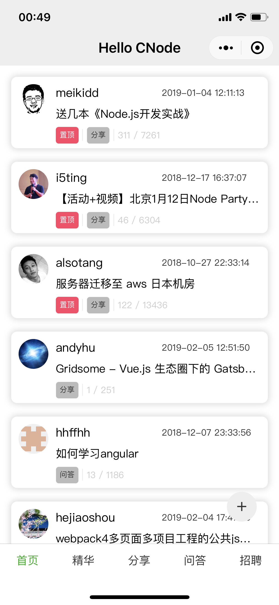
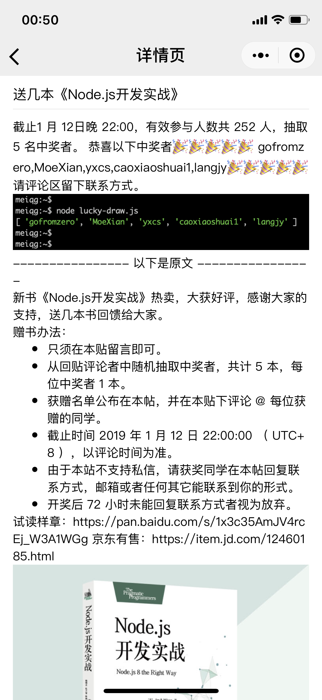
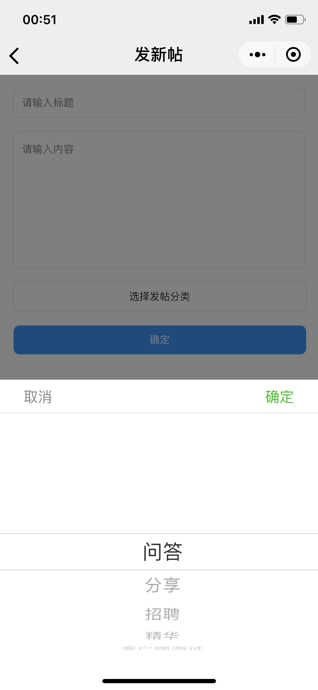

# hello-cnode

> a cnode miniprogram base on mpvue


---

> 讲道理，可能是最丑的的 cnode 小程序客户端之一

#### 运行实图
- 首页



- 详情



- 发帖



### 功能清单

#### 已完成

- [x] 查看
- [x] 分类
- [x] 发帖
- [x] 登录
- [x] 回帖
- [x] 点赞
- [x] 收藏/取消收藏

#### 待完成
- [ ] 回复评论
- [ ] 查看收藏
- [ ] 评论带图片
- [ ] 发帖带图片

## Build Setup

``` bash
# install dependencies
npm install

# serve with hot reload at localhost:8080
npm run dev

# build for production with minification
npm run build

# build for production and view the bundle analyzer report
npm run build --report
```

For detailed explanation on how things work, checkout the [guide](http://vuejs-templates.github.io/webpack/) and [docs for vue-loader](http://vuejs.github.io/vue-loader).
